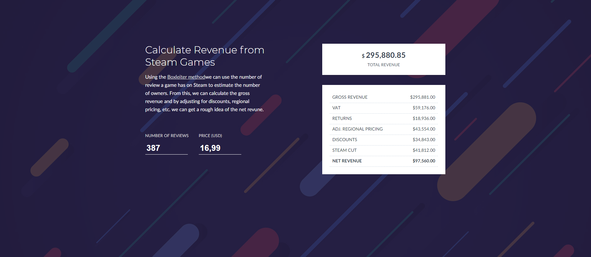

# Steam Revenue Calculator



[](https://app.netlify.com/sites/jovial-tesla-446fc9/deploys)

Estimate the revenue of a game on Steam.

Using the [Boxleiter method](http://greyaliengames.com/blog/how-to-estimate-how-many-sales-a-steam-game-has-made/)    we can use the number of review a game has on Steam to estimate the number of owners. From this, we can calculate the gross revenue and by adjusting for discounts, regional pricing, etc. we can get a rough idea of the net revune.

## Development

After cloning the Repository and installing the dependecies you can start the project by running

```sh
yarn start
```

and opening `http://localhost:3000` in your browser.

You can run the test suit with the command

```sh
yarn test
```
